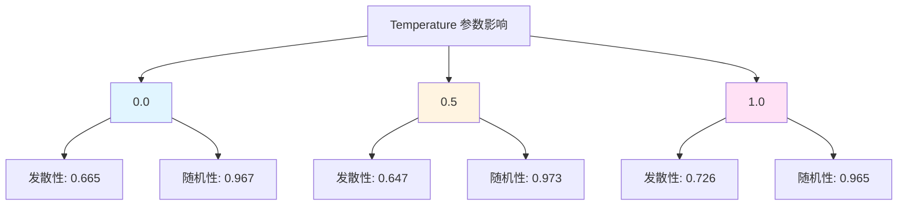
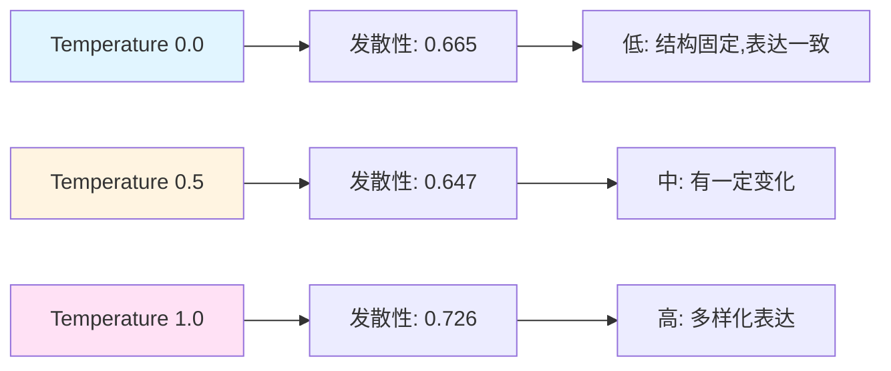
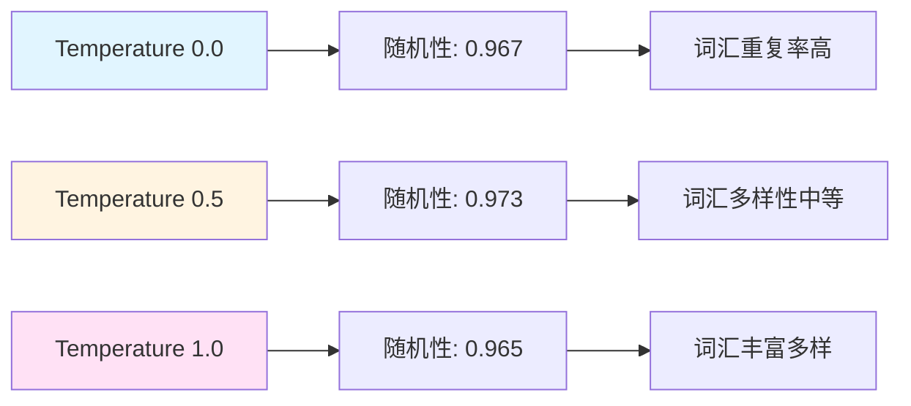
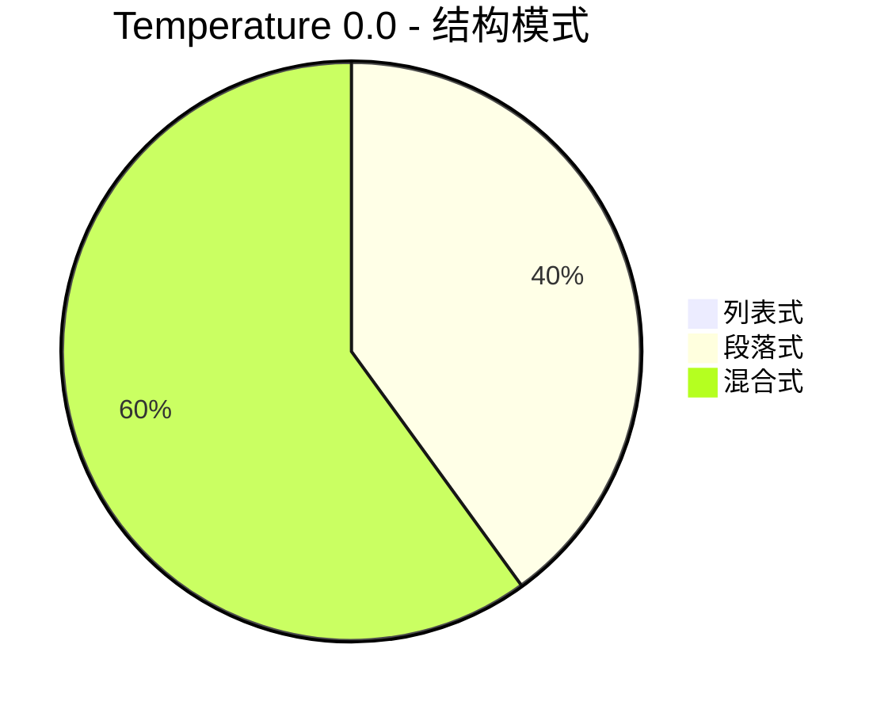
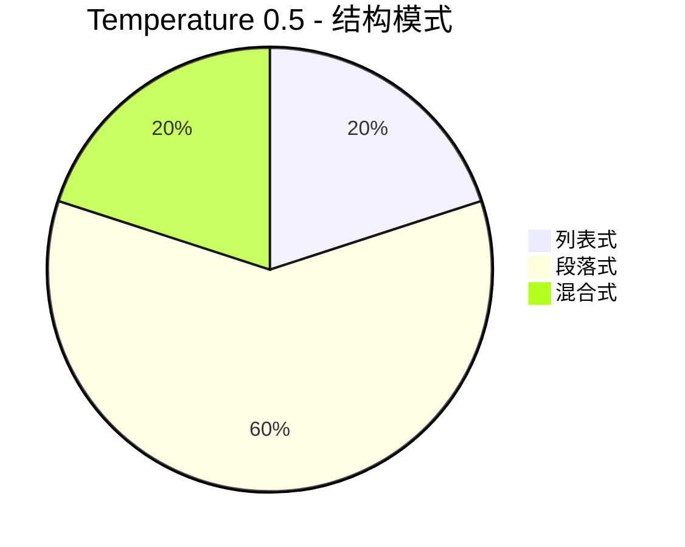
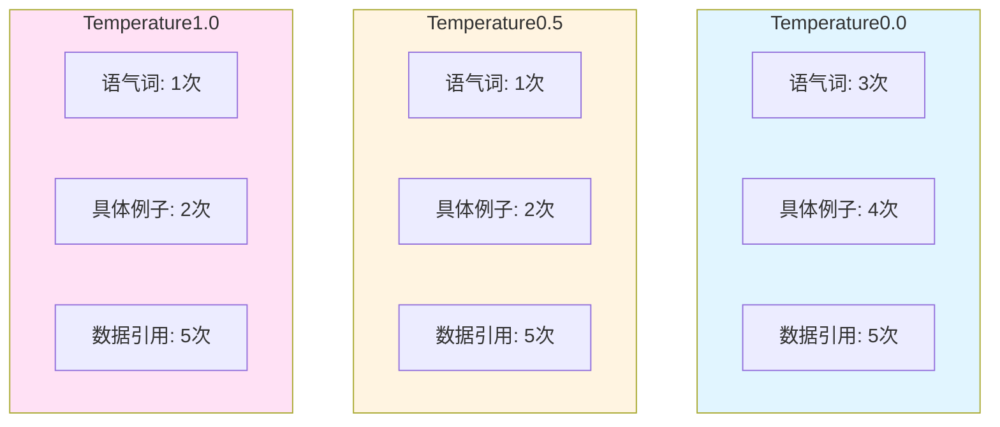
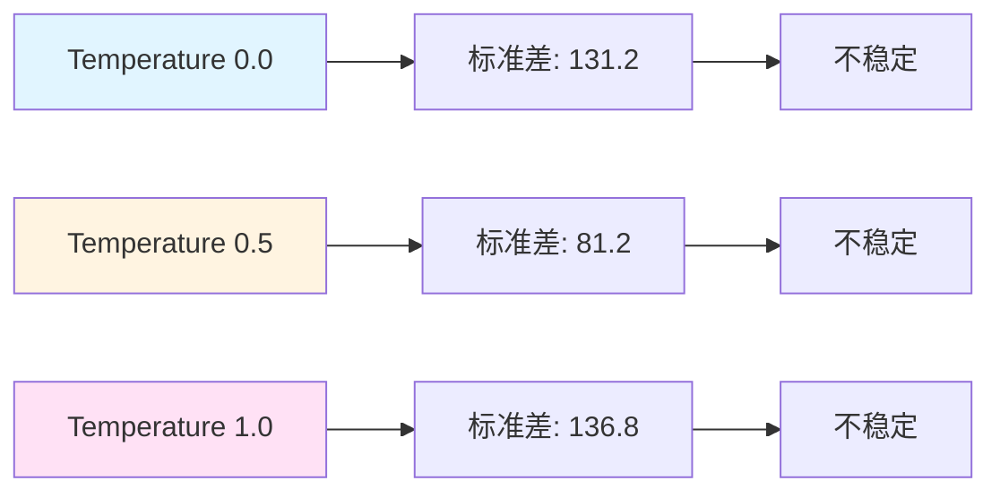

# Temperature 对比分析 - 问题2: 上海活动建议

## 1. 发散性与随机性对比



## 2. 发散性横向对比



## 3. 随机性横向对比



## 4. 结构模式分布对比






## 5. 表达风格特征对比



## 6. 回复长度统计对比

| Temperature | 最短 | 最长 | 平均 | 标准差 |
|:-----------|:----|:----|:----|:------|
| 0.0 | 164 | 514 | 319.8 | 131.2 |
| 0.5 | 149 | 363 | 240.8 | 81.2 |
| 1.0 | 151 | 441 | 319.2 | 136.8 |

## 7. 长度稳定性对比



## 8. 语义内容关键词对比

```mermaid
graph TB
    subgraph Temperature0.0
    A0[关键词频率]
    多云: 1<br/>阴: 5<br/>雨: 4<br/>舒适: 2<br/>湿度: 5
    end

    subgraph Temperature0.5
    B0[关键词频率]
    阴: 5<br/>雨: 3<br/>舒适: 2<br/>湿度: 5<br/>温度: 2
    end

    subgraph Temperature1.0
    C0[关键词频率]
    多云: 1<br/>阴: 5<br/>雨: 3<br/>舒适: 2<br/>炎热: 1
    end

    style Temperature0.0 fill:#e1f5ff
    style Temperature0.5 fill:#fff4e1
    style Temperature1.0 fill:#ffe1f5
```

## 9. 综合对比雷达图数据

| 维度 | Temperature 0.0 | Temperature 0.5 | Temperature 1.0 |
|:-----|:----------------|:----------------|:----------------|
| 发散性 | 0.665 | 0.647 | 0.726 |
| 随机性 | 0.967 | 0.973 | 0.965 |
| 列表化倾向 | 0.0 | 0.2 | 0.0 |
| 长度稳定性 | -0.3 | 0.2 | -0.4 |
| 表达丰富度 | 0.7 | 0.3 | 0.3 |

---

**分析时间**: 自动生成  
**数据来源**: temperature:*_outputs.log
